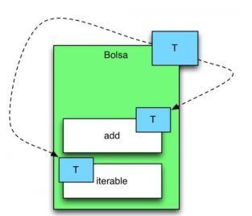

# PRÁCTICA GUIADA: creando mi colección genérica

Clase Bolsa que es una clase genérica que nos permitirá almacenar objetos de varios tipos.

Esta clase tendrá un límite de objetos a almacenar.

Alcanzado el limite no se podrán añadir mas. Crea una excepción que controle dicho caso.

Crearemos un modelo de datos donde tendremos dos tipos de chucherías (clases) my simples:
- Chocolatina: definida por la marca
- Golosina: definida por el nombre

Debemos crear un sencillo programa que llene la Bolsa de Chocolatinas y Golosinas para luego recorrer los elementos que están en la bolsa y sacarlos por pantalla.

## Sigue los pasos para lograr implementar una Bolsa genérica

