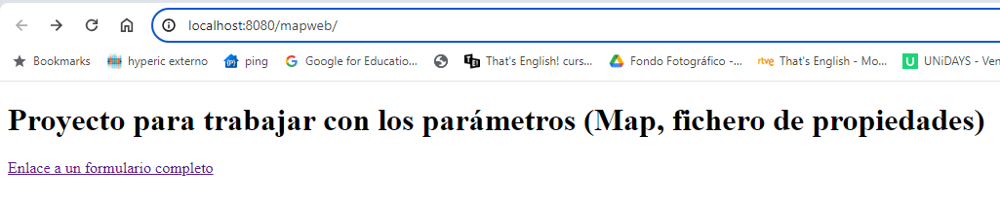
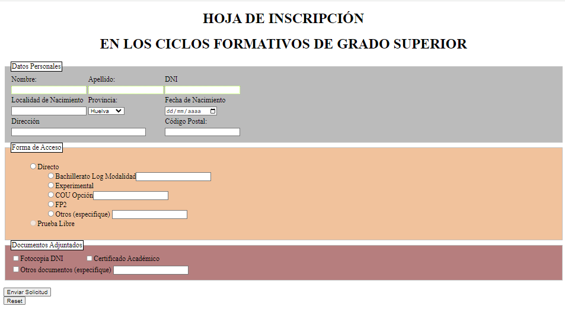
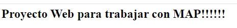

# Proyecto WEB para trabajar con la colección MAP

## FASE I: Pasos

### Pasos
1. Descarga el proyecto completo
2. Con Maven, crea el paquete WAR
3. Añade dicho paquete a Tomcat (opción Add Deployment)
4. Visualiza tu proyecto en el navegador (Server Actions/Show in Browser)

### Lo que debes obtener

Muestra el formulario:

Envía la solicitud y el servlet te responderá:

## FASE II: aprendiendo a recoger los parámetros con MAP

